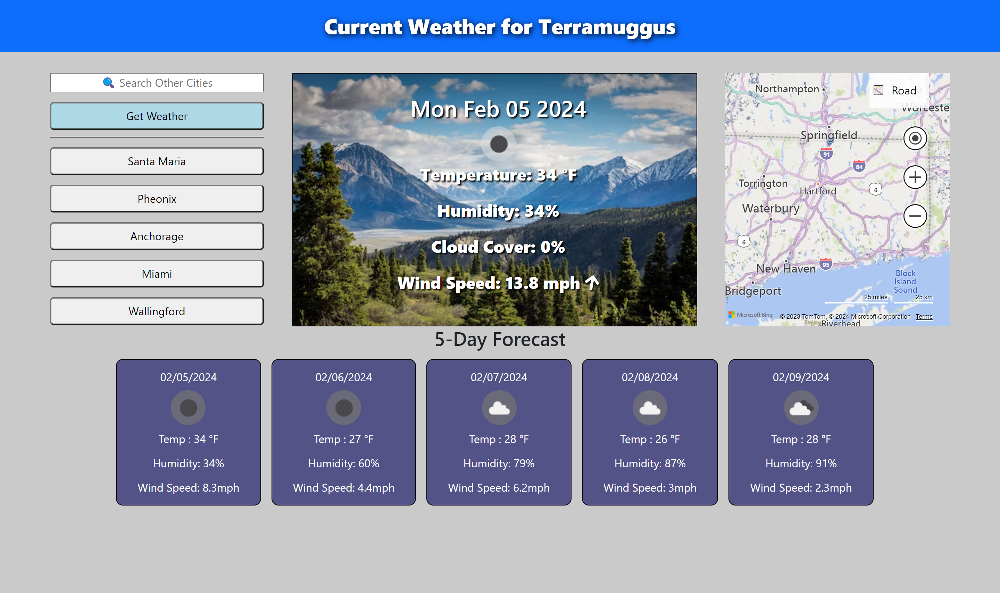
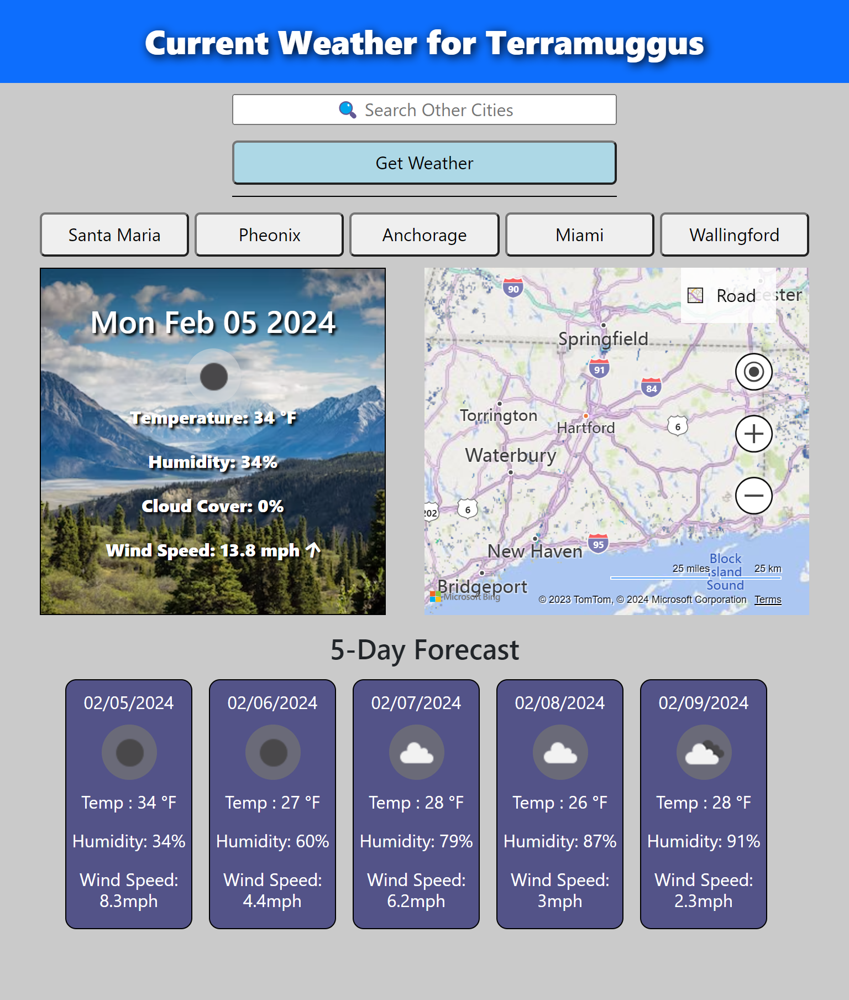
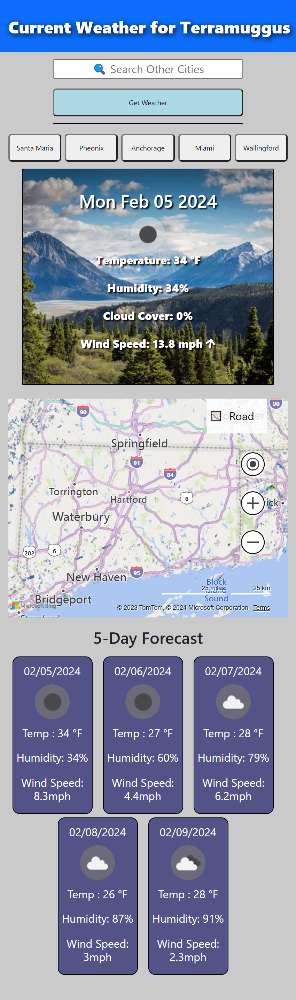

# Weather Dashboard

## Overview
I created this weather dashboard so that users have a quick and efficient way to check the current weather, radar map with rain overlay, and the 5 day forecast for their location by default as well as any location across the globe that they would like to view the weather forecast for utilizing the "search other cities" input.

## Features

1. Responsive Design

   * I designed my webpage to be fully responsive from the smallest mobile devices, to tablets, to the largest desktops to provide a consistent means to view the weather dashboard in an enjoyable and engaging experience.

2. Search Bar

    * At the top left of the page, you will find an input field that will allow you to search the weather for any city of your choice. Upon pressing enter or clicking the "Get Weather" button, the application then creates a button for your search and saves it to your local storage, making it easier to navigate back to your top searched cities. This feature will save 5 different buttons before overwriting the oldest button with your newest search criteria. When entering a new city into the input field, it will retrieve and display the data to the weather card, radar map, weather header, and 5-Day Forecast.

3. Weather Card

    * Near the top center of the page, you will find a weather card that displays the current forecast data for your location by default, or the location you searched.

4. Radar Map

    * At the top right of the page, you will find a radar map with a rain overlay. This shows the rain forecast for your location by default, or the location you searched.

5. 5-Day Forecast

    * At the bottom of the page, you will find the 5-Day Forecast. This displays weather for the next 5 days for your location by default, or the location you searched.

6. Weather Header

    * At the top of the page located within the blue nav bar, you will find the weather header. This will dynamically display the city name based on your location by default, or the location you searched.

7. Technologies Used

    * HTML5
    * CSS
    * JavaScript
    * Bootstrap
    * Font Awesome
    * BING Maps API
    * OpenWeatherMap API
    * VSCode
    * GitBash

## Usage
To view this webpage, please visit https://joshmassa.github.io/weather-dashboard/

To view this projects repository, please visit https://github.com/JoshMassa/weather-dashboard

When viewed from a desktop, the webpage should resemble the following image:

When viewed from a tablet, the webpage should resemble the following image:

When viewed from a mobile device, the webpage should resemble the following image:

## Credits

This project brought to you in part by UCLA Extension and its staff including but not limited to: Our class instructor and teaching assistant of UCLA Extension Coding Bootcamp 2023-2024.

Links to resource references used as follows:

BING Maps Live Radar: https://www.bing.com/api/maps/sdk/mapcontrol/isdk/weatherradarmap#JS

Bootstrap: https://getbootstrap.com/docs/5.3/getting-started/introduction/

OpenWeatherMap API: https://openweathermap.org

## License
This project does not contain a license.